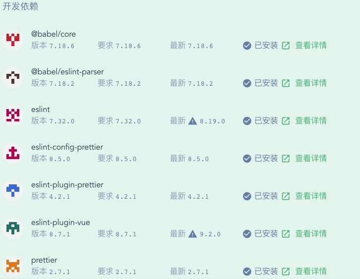
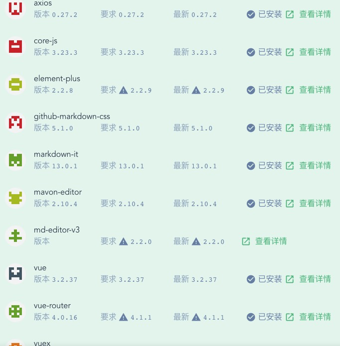

# 个人博客项目前端简介
## 技术栈
- Vue 5.0.6
- element-ui (Element-plus)
- axios
- md-editor-v3
- markdown-it
- github-markdown-css

## 项目依赖
### 开发依赖

### 运行依赖

> eslint/prettier配置信息见项目配置文件。Vue3开始element-ui、axios、vuex等依赖的引入方式发生变化，具体参考[vue3插件和引入方式](https://blog.csdn.net/qq_41998083/article/details/109742416)或查看本项目的main.js文件
## 安装和配置命令
### Project setup
```
npm install
```

### Compiles and hot-reloads for development
```
npm run serve
```

### Compiles and minifies for production
```
npm run build
```

### Lints and fixes files
```
npm run lint
```
### 查看当前项目的Vue版本
```
vue -V
```
### 卸载Vue
```
npm uninstall vue-cli -g
```
### 安装最新版本Vue
```
cnpm install -g @vue/cli
```
### 打开vue的可视化管理工具界面
```
vue ui
```
### 安装Element-plus（vue3以上的版本不支持旧版element ui）
```
npm install element-plus --save
```
### 安装支持Vue3及以上版本的富文本编辑器:md-editor-v3
```
npm install md-editor-v3
```
### Vue解析markdown的插件markdown-it
```js
// 用于解析markdown文档
cnpm install markdown-it --save

// md样式
cnpm install github-markdown-css
```
## 某些组件和标签用法
### `this.$route.params` 的使用：

开始得在`route`文件里面，写入
```js
{
    path:'/yy/xx/:id',
    component: 组件名
}
```
然后可以用 `this.$route.params` 获取一个对象，里面就有`id` 值了

以本项目为例，在`router`目录下的`index.js`文件中为博客详情页配置路由：
```js
const routes = [
  {
    path: '/blog/:blogId',
    name: 'BlogDetail',
    component: BlogDetail
  }
]
```
然后就可以在BlogDetail.vue中调用`this.$route.params`获取当前博客id了：
```js
const blogId = this.$route.params.blogId
```
---
### Vue生命周期中`mounted`和`created`的区别
- 什么是生命周期
  - 用通俗的语言来说，就是 Vue中实例或者组件从创建到消灭中间经过的一系列过程
- created和mounted区别
  - created:在模板渲染成html前调用，即通常初始化某些属性值，然后再渲染成视图
  - mounted:在模板渲染成html后调用，通常是初始化页面完成后，再对html的dom节点进行一些需要的操作
- **特别注意**
  - 不要在`cerated()`中对页面元素进行操作，这些步骤应该放在`mounted()`中，理由如下
  - 在created的时候，视图中的html并没有渲染出来，所以此时如果直接去操作html的dom节点，一定找不到相关的元素
  - 而在mounted中，由于此时html已经渲染出来了，所以可以直接操作dom节点
  ---
### `<router-link>`标签使用详解
- 作用：用于替代`<a>`标签来实现链接跳转功能，在页面上显示还是会被渲染成a标签的样式

*`<router-link>`组件的属性有：*
- to（必选参数）：类型string/location
  - 表示目标路由的链接，该值可以是一个字符串，也可以是动态绑定的描述目标位置的对象
  ```html
  <!-- 字符串 -->
  <router-link to="home">Home</router-link>
  <!-- 渲染结果 -->
  <a href="home">Home</a>
  
  <!-- 使用 v-bind 的 JS 表达式 -->
  <router-link v-bind:to="'home'">Home</router-link>
  
  <!-- 不写 v-bind 也可以，就像绑定别的属性一样 -->
  <router-link :to="'home'">Home</router-link>
  
  <!-- 同上 -->
  <router-link :to="{ path: 'home' }">Home</router-link>
  
  <!-- 命名的路由 -->
  <router-link :to="{ name: 'user', params: { userId: 123 }}">User</router-link>
  
  <!-- 带查询参数，下面的结果为 /register?plan=private -->
  <router-link :to="{ path: 'register', query: { plan: 'private' }}">Register</router-link>
  ```
- replace: 类型boolean，默认值false
  - 设置 `replace` 属性的话，当点击时，会调用 `router.replace()` 而不是 `router.push()`，于是导航后不会留下 `history` 记录。
  ```html
  <router-link :to="{ path: '/abc'}" replace></router-link>
  ```
- append: 类型boolean，默认值false
  - 设置 `append`属性后，则在当前（相对）路径前添加基路径。例如，我们从 `/a`导航到一个相对路径 `b`，如果没有配置 `append`，则路径为`/b`，如果配了，则为`/a/b`
- tag: 类型string，默认值 'a'
  - 有时候想要 `<router-link>`渲染成某种标签，例如`<li>`。 于是我们使用`tag prop`类指定何种标签，同样它还是会监听点击，触发导航
  ```html
  <router-link to="/foo" tag="li">foo</router-link>
  <!-- 渲染结果 -->
  <li>foo</li>
  ```
> 其他属性的用法可参考 [router-link属性详解](https://blog.csdn.net/cdgogo/article/details/107866489)

## 一些报错的解决
### WebSocket connection to 'ws://192.168.1.5:8080/ws' failed
- 原理：运行vue前端代码的时候，服务器还会运行一个`websocketClient`,与服务器通信。如果检查到代码有修改，就会刷新页面。 如果`websocket`通信有问题是不会正常进行热重载的
- 项目本地运行时，由于是前后端分离，`vue-cli-servece` 不能正常检测到后端的IP和端口，而是直接前端所在的局域网ip和端口号，从而导致`websocket`通信
- 解决方案1：[直接修改vue.config.js](https://blog.csdn.net/weixin_59237016/article/details/124067586)
  ```js
  const { defineConfig } = require('@vue/cli-service')
  module.exports = defineConfig({
    devServer: {
        host: '0.0.0.0',
        // https:true,
        port: 8081,
        // 关键是client配置项
        client: {
          webSocketURL: 'ws://0.0.0.0:8081/ws',
        },
        headers: {
          'Access-Control-Allow-Origin': '*',
        }
    },
    transpileDependencies: true
  })
  ```
  > *该方案并未生效*
- 解决方案2：在`vue.config.js`文件中修改proxy代理配置，`ws:true`改为`false`
  ```js
  module.exports = {
    publicPath: './',
    lintOnSave: false, // 关闭语法检查
    devServer: {
      proxy: {
        '/': {
          target: 'http://localhost:3000/', // 本地后端地址
          changeOrigin: true, //允许跨域
          ws: false
        }
      }
    }
  }
  ```
  > 关闭`ws`后，成功解决websocket报错问题


## Customize configuration
See [Configuration Reference](https://cli.vuejs.org/config/).
